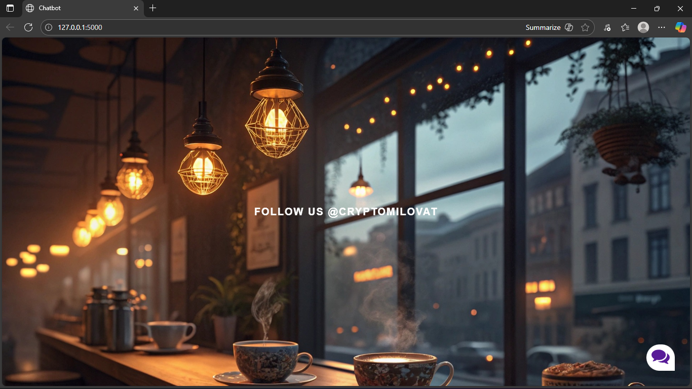
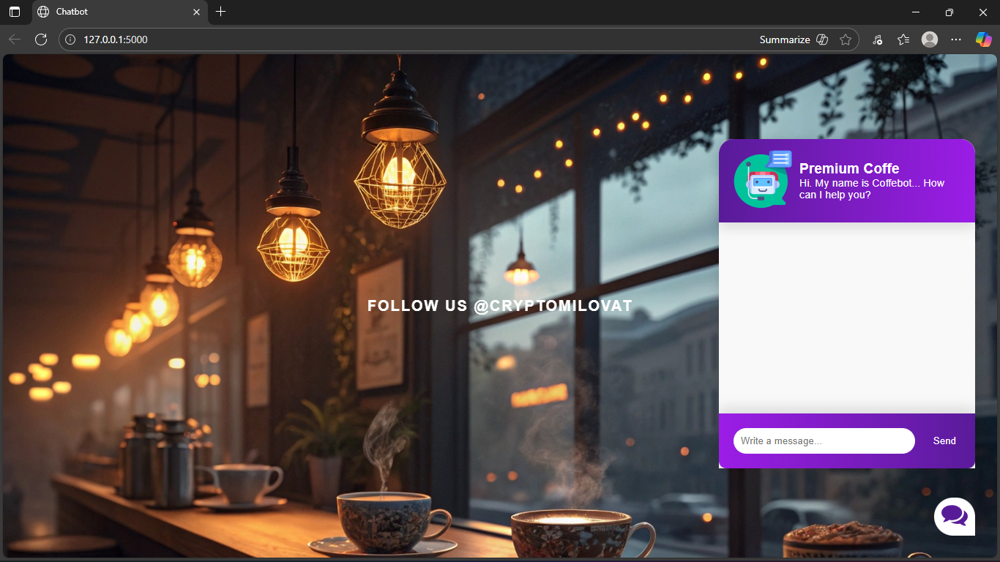
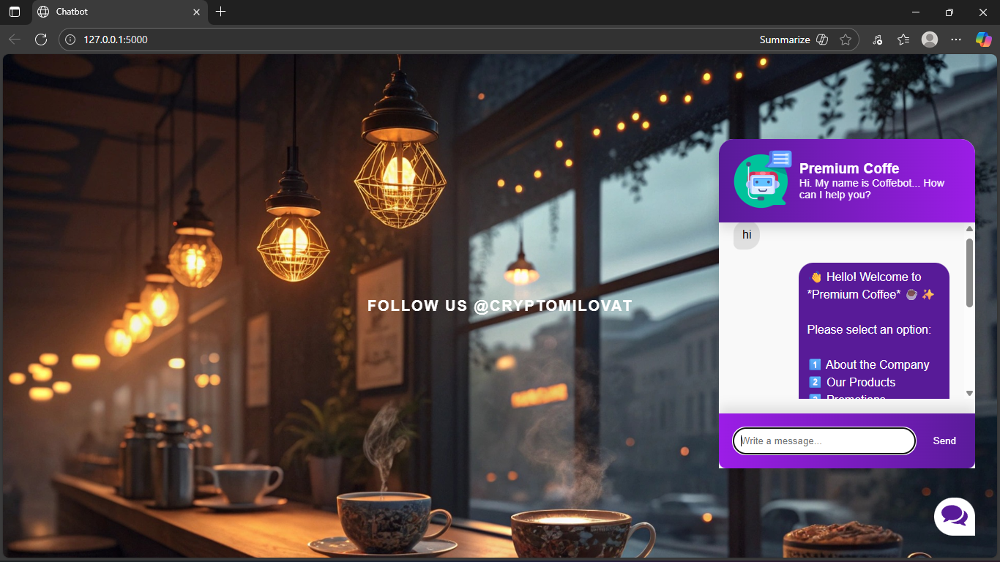
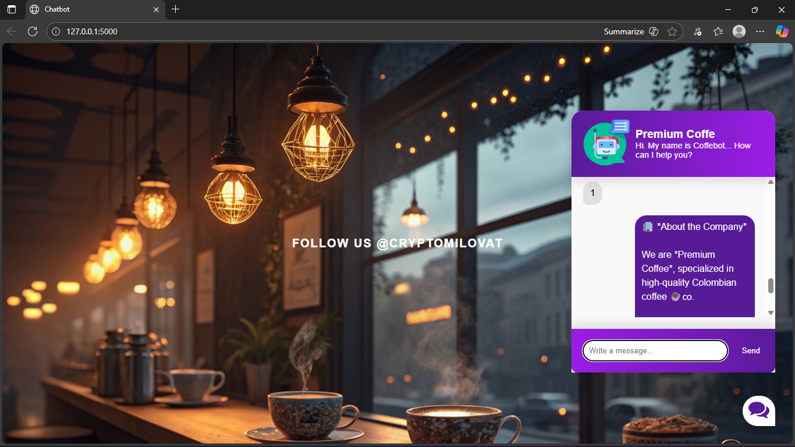
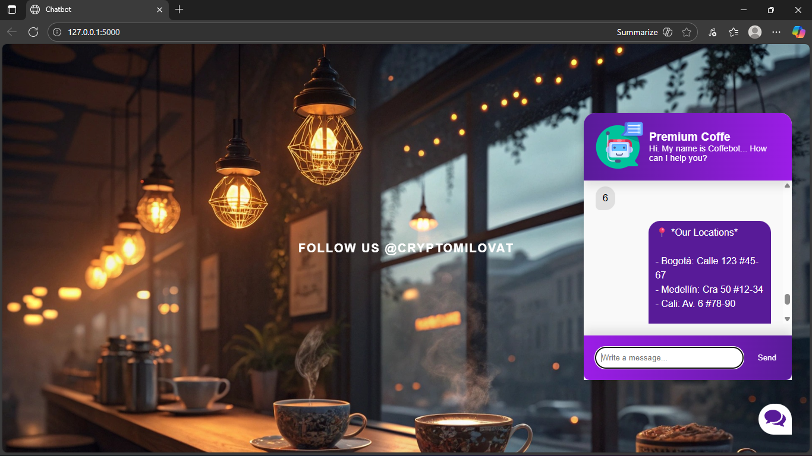
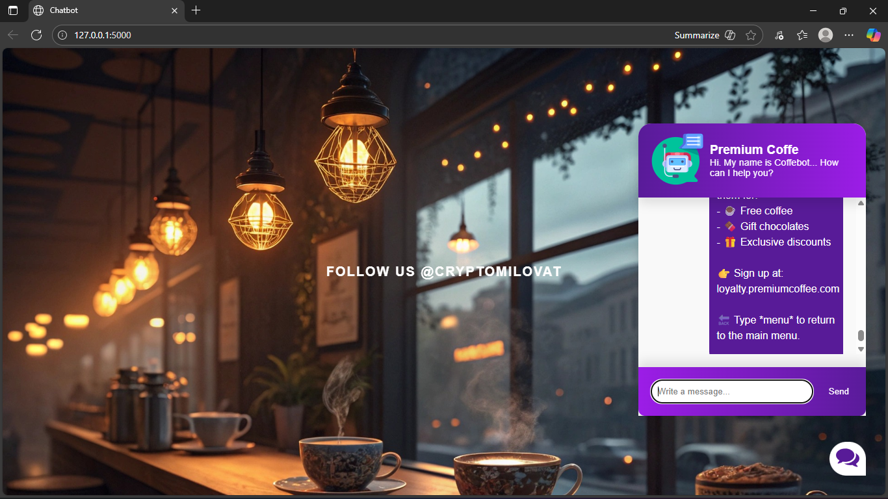
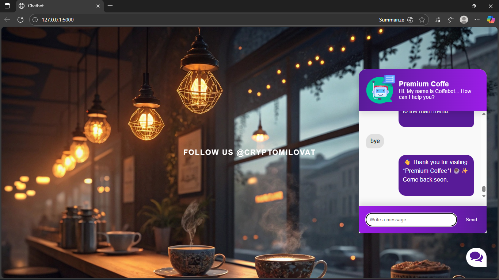

#  Chatbot with Flask & Machine Learning

An interactive chatbot built with **Python, Flask, and Machine Learning fundamentals**.  
It simulates a support assistant for a coffee company (*Premium Coffee* ☕), capable of handling FAQs like products, locations, promotions, and loyalty programs.  

The project demonstrates:
- API development with **Flask**  
- **Machine Learning (NLTK + PyTorch basics)** for intent recognition  
- Frontend integration with HTML, CSS, and JavaScript  
- A professional chatbot flow in English with menu navigation  

---

##  Demo

 
 
 
 
 
 
 
 
 
 
 
 
 
 
 

---

##  live demo

You can try the chatbot here [Chatbot in Render](https://chatbot-premium-coffee.onrender.com/)

---

##  Technologies Used
- **Python 3.9+**
- **Flask** (backend web framework)
- **NLTK** (natural language processing)
- **PyTorch** (basic ML training)
- **HTML5 + CSS3 + JavaScript** (frontend integration)
- **JSON** (intents dataset for chatbot training)

---

##  Installation & Setup

Clone the repository:

bash
git clone https://github.com/DanielRodriguez9/chatbot-flask-ml.git
cd chatbot-flask-ml

---

- Create and activate a virtual environment (recommended):

python -m venv venv
source venv/bin/activate   # On Linux/Mac
venv\Scripts\activate      # On Windows

- Install dependencies:

  pip install -r requirements.txt

- Usage

Run the Flask app:

python app.py

Open your browser and go to:

http://127.0.0.1:5000/

You’ll see the chatbot interface where you can start chatting.

---

## Example Usage

 Hello! Welcome to *Premium Coffee* 
Please select an option:

1 About the Company
2️ Our Products
3️ Promotions
4️ Payments & Shipping
5️ Contact an Agent
6️ Locations
7️ Hours
8️ Technical Support
9️ Loyalty Program

 Reply with the number of your choice.

---

Typing menu always brings you back to the Main Menu.

 Project Structure
chatbot-flask-ml/
│── app.py              # Flask entry point
│── chat.py             # Chatbot logic
│── model.py            # ML model structure
│── train.py            # Model training
│── nltk_utils.py       # NLP helper functions
│── intents.json        # Intents dataset
│── requirements.txt    # Project dependencies
│── static/             # CSS, JS, images
│── templates/          # HTML templates

---

## Future Improvements

Deploy to Render / Railway / AWS

Add JWT authentication for secure API access

Connect to a database for storing chat history

Train with more advanced ML/NLP models

## Author

Daniel Ricardo Rodriguez (Crypto Milovat)
 Email: ricardoparra09999@gmail.com

